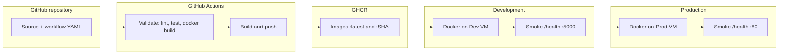
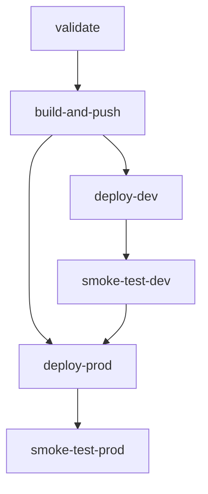

# PeEx-tasks

Flask **Server Load Simulator**: a small web UI and API for synthetic CPU load (useful for demos and infrastructure testing). This repository includes a full **CI/CD** pipeline on GitHub Actions: build, tests, Docker image publishing to **GitHub Container Registry (GHCR)**, and sequential deployment to **Development** and **Production**.

---

## Contents

- [CI/CD architecture](#cicd-architecture)
- [Pipeline stages](#pipeline-stages)
- [Triggers](#triggers)
- [Environments and promotion](#environments-and-promotion)
- [Secrets and configuration](#secrets-and-configuration)
- [Artifact versioning](#artifact-versioning)
- [Local development](#local-development)

---

## CI/CD architecture

End-to-end flow from commit to production: GitHub hosts the source, Actions runs checks and builds, images are stored in GHCR, and deployment targets VMs (e.g. EC2) over SSH with Docker.



Job order on **push to `main`** (simplified):



> **Note:** `deploy-prod` requires both a successful `build-and-push` and a successful `smoke-test-dev`, so production is not deployed until Dev is healthy.

---

## Pipeline stages

Configuration file: [`.github/workflows/cicd.yml`](.github/workflows/cicd.yml).

| Step | Job | Description |
|------|-----|-------------|
| 1 | **validate** | Checkout, Python 3.10, `pip install -r requirements.txt`, install flake8 and pytest, **flake8** (critical errors), **pytest**, validation **docker build** (local tag `peex-tasks:test`) |
| 2 | **build-and-push** | Only on **push** to `main`, after a successful validate. Log in to **GHCR**, build the image, push `latest` and `${GITHUB_SHA}` |
| 3 | **deploy-dev** | SSH to the Dev host, `docker login` to GHCR, `pull` the image by SHA, restart container `load-app-dev`, port **5000→5000** |
| 4 | **smoke-test-dev** | `curl` to `http://<DEV_IP>:5000/health` |
| 5 | **deploy-prod** | SSH to Prod, same pull/run pattern, container `load-app-prod`, port **80→5000** |
| 6 | **smoke-test-prod** | `curl` to `http://<PROD_IP>/health` |

If any job fails, downstream jobs do not run (**fail fast** via `needs` dependencies).

---

## Triggers

| Event | What runs |
|-------|-----------|
| **Pull request** targeting `main` | **validate** only (lint, tests, validation docker build). Deploy and registry push are **not** started (`if: github.event_name == 'push'` on those jobs). |
| **Push** to `main` | Full path: validate → build-and-push → deploy-dev → smoke-test-dev → deploy-prod → smoke-test-prod. |

Changes are validated on PRs; publishing the image and deploying environments happens only after merge to `main`.

---

## Environments and promotion

| Environment | GitHub Environment | App URL pattern | Container |
|-------------|-------------------|-----------------|-----------|
| **Development** | `development` | HTTP on port **5000** (e.g. `http://<DEV_IP>:5000`) | `load-app-dev` |
| **Production** | `production` | HTTP on port **80** (e.g. `http://<PROD_IP>/`) | `load-app-prod` |

**Promotion (Dev → Prod):** the same image (commit tag `${GITHUB_SHA}`) is deployed to Dev first; after **smoke-test-dev** succeeds, **deploy-prod** may run. Production **depends** on a successful Dev smoke test, so promotion is enforced by the workflow graph.

**Approval (manual vs automatic):** deploy jobs use `environment: development` and `environment: production`. In **Settings → Environments**, you can enable **Required reviewers** or a **Wait timer** for **production** (and optionally **development**) so jobs wait for manual approval in the GitHub UI. With no protection rules, stages proceed **automatically** after the previous steps succeed.

---

## Secrets and configuration

Sensitive values are **not** committed; use **GitHub Secrets** (and environment variables where appropriate):

| Secret | Purpose |
|--------|---------|
| `AWS_DEV_IP` | Public IP of the Dev instance (deploy and smoke test) |
| `AWS_PROD_IP` | Public IP of the Prod instance |
| `AWS_SSH_KEY` | Private SSH key for user `ubuntu` on both servers |
| `GITHUB_TOKEN` | Provided by Actions; used in deploy scripts for `docker login ghcr.io` |

The `build-and-push` job also uses `GITHUB_TOKEN` on the runner with `packages: write` to push to GHCR.

---

## Artifact versioning

- **Registry:** `ghcr.io/kboretska/peex-tasks` (set via `IMAGE_NAME` in the workflow).
- **Tags:** `latest` and **`${GITHUB_SHA}`** — the image is traceable to the commit on `main`.
- If you change `IMAGE_NAME` or the registry owner, update `.github/workflows/cicd.yml` accordingly.

---

## Local development

```bash
python -m venv .venv
.venv\Scripts\activate   # Windows
pip install -r requirements.txt
set PYTHONPATH=.
pytest -v
python app_web.py
```

The app listens on `0.0.0.0:5000`. Build and run the image locally:

```bash
docker build -t peex-tasks:local .
docker run -p 5000:5000 peex-tasks:local
```

On Linux or macOS, use `source .venv/bin/activate` and `export PYTHONPATH=.` instead of the Windows lines above.

---

## Repository layout (summary)

| Path | Description |
|------|-------------|
| `app_web.py` | Flask entrypoint (used by Docker and tests) |
| `templates/index.html` | Web UI for the load simulator |
| `tests/test_app.py` | Pytest coverage for routes |
| `Dockerfile` | Python 3.10 slim image, `CMD` runs `app_web.py` |
| `.github/workflows/cicd.yml` | Full CI/CD workflow |
