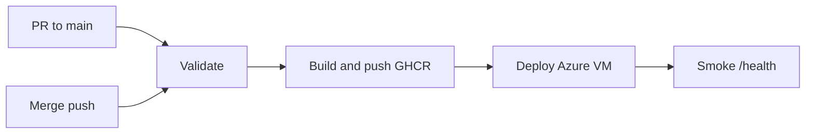

# PeEx-tasks

Flask **Server Load Simulator** (web UI + API for synthetic CPU load) with **Infrastructure as Code** on **Microsoft Azure** (Terraform) and **CI/CD** on **GitHub Actions** (tests, Docker build, **GHCR** publish, deploy to an **Azure VM**).

---

## Repository structure

Logical layout for collaboration and auditing (IaC separated from application code):

| Path | Purpose |
|------|---------|
| `app_web.py`, `app.py` | Flask entrypoints |
| `templates/` | HTML UI |
| `tests/` | Pytest |
| `Dockerfile`, `requirements.txt`, `.dockerignore` | Container image |
| `.github/workflows/cicd.yml` | CI/CD pipeline |
| `infra/azure/terraform/` | Terraform: resource group, VNet, subnet, NSG, VM, storage (`*.tf`, `templates/`, `terraform.tfvars.example`) |
| `infra/azure/README.md` | Azure architecture, deploy/destroy, variables, troubleshooting, CI secrets |
| `CONTRIBUTING.md` | **Branching**, **conventional commits**, **releases (semver tags)**, secrets policy, clone-and-run |
| `.gitignore` | Python, Terraform state/plans, local `*.tfvars`, tooling noise |

```text
PeEx-tasks/
├── .github/workflows/
├── infra/azure/
│   ├── README.md
│   └── terraform/
│       ├── *.tf
│       ├── templates/
│       ├── terraform.tfvars.example
│       └── .terraform.lock.hcl   # commit this; do not commit .terraform/ or *.tfstate
├── templates/
├── tests/
├── app_web.py
├── Dockerfile
├── requirements.txt
├── CONTRIBUTING.md
└── README.md
```

---

## Quick start

### Application (local)

```bash
git clone https://github.com/<your-org>/PeEx-tasks.git
cd PeEx-tasks
python -m venv .venv
# Windows: .venv\Scripts\activate
# Linux/macOS: source .venv/bin/activate
pip install -r requirements.txt
set PYTHONPATH=.    # Windows; Linux/macOS: export PYTHONPATH=.
pytest -v
python app_web.py   # http://127.0.0.1:5000
```

### Infrastructure (Terraform on Azure)

See **`infra/azure/README.md`**: prerequisites (`az`, `terraform`), `terraform.tfvars` from `terraform.tfvars.example`, `terraform init && plan && apply`, and `terraform destroy`.

---

## Version control and releases

- **Branches:** feature work on `feature/*` (or `fix/*`), merge to **`main`** via **Pull Request** (see **`CONTRIBUTING.md`**).
- **Commits:** prefer **conventional** messages (`feat:`, `fix:`, `infra:`, `docs:`, `ci:`).
- **Releases:** tag stable points with **semantic versioning**, e.g. **`v1.0.0`** (`git tag -a v1.0.0 -m "..." && git push origin v1.0.0`).

---

## CI/CD (summary)

File: [`.github/workflows/cicd.yml`](.github/workflows/cicd.yml).

| Trigger | Jobs |
|---------|------|
| **Pull request** to `main` | **Validate, Lint and Test** (flake8, pytest, validation `docker build`) |
| **Push** to `main` | validate → build & push image to **GHCR** (`ghcr.io/<owner>/<repo>` lowercase) → **Deploy to Azure VM** (SSH, `docker pull` / `run`) → **smoke test** `http://<VM>:5000/health` |

**GitHub:** create environment **`azure`** with secrets **`AZURE_VM_HOST`**, **`AZURE_SSH_PRIVATE_KEY`** (optional **`GHCR_READ_TOKEN`**). Details: `infra/azure/README.md` (section CI/CD).



---

## Security

- **Never commit** Terraform state, `terraform.tfvars`, private keys, or tokens. `.gitignore` excludes common Terraform and Python artifacts; see **`CONTRIBUTING.md`**.
- **Commit** `.terraform.lock.hcl` for reproducible provider versions.

---

## Documentation index

| Document | Content |
|----------|---------|
| **README.md** (this file) | Purpose, structure, quick start, CI summary |
| **CONTRIBUTING.md** | Branching, commits, semver tags, PR checklist, clone+IaC |
| **docs/devops-version-control.md** | Assignment checklist: screenshots, tag command, criteria mapping |
| **infra/azure/README.md** | Azure architecture diagram, Terraform usage, CI secrets |

---

## License / course use

Use and adapt for coursework; keep sensitive data out of Git.
