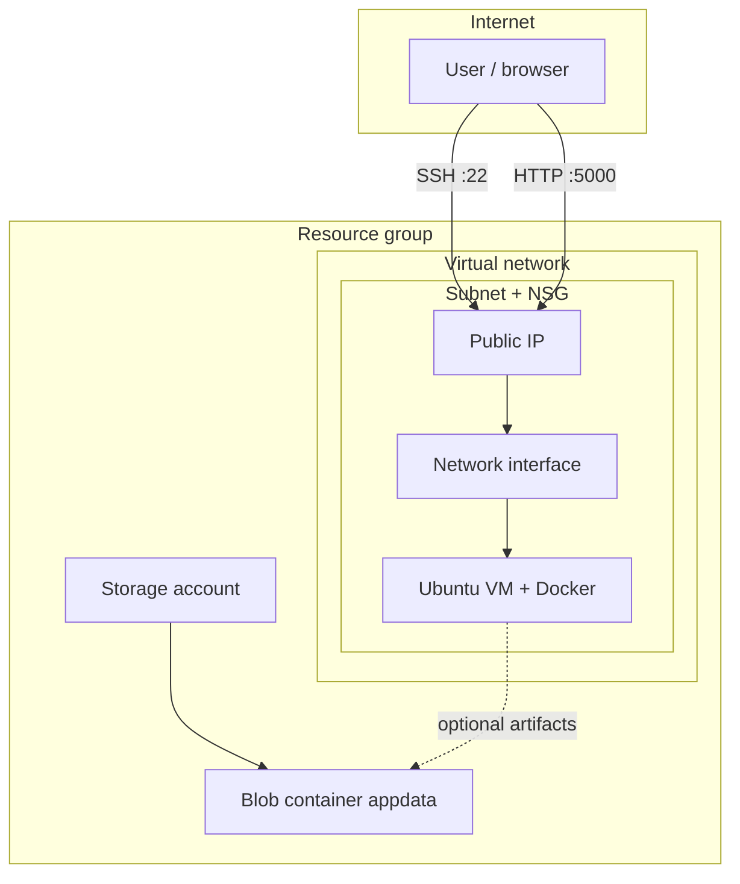

# Azure infrastructure (Terraform)

This directory provisions a minimal application environment in **Microsoft Azure**: resource group, virtual network and subnet, network security group (SSH + app port), Ubuntu 22.04 VM with public IP, managed OS disk, and a storage account with a private blob container for artifacts or data. The VM is prepared via **cloud-init** to install **Docker** so you can run the PeEx-tasks Flask app from this repository.

## Architecture



- **Network**: One VNet (`address_space`, default `10.42.0.0/16`) and one subnet (`10.42.1.0/24`).
- **Security**: NSG on the subnet allows inbound TCP **22** (SSH) and **5000** (Flask app). Source ranges are configurable (restrict SSH in production).
- **Compute**: Single Linux VM (`Standard_B2s` by default), system-assigned managed identity, SSH key authentication only (no password).
- **Storage**: General-purpose v2 storage account (LRS by default), private container `appdata`, TLS 1.2 minimum, HTTPS-only, soft-delete retention on blobs.

## Prerequisites

- An Azure subscription and permission to create resource groups and resources.
- [Azure CLI](https://learn.microsoft.com/en-us/cli/azure/install-azure-cli) installed and signed in:

  ```bash
  az login
  az account set --subscription "<subscription-id-or-name>"
  ```

- [Terraform](https://developer.hashicorp.com/terraform/install) `>= 1.5`.
- An **RSA SSH public key** (`ssh-rsa ...`). Azure Linux VMs do **not** accept Ed25519 for `admin_ssh_key`; generate with `ssh-keygen -t rsa -b 4096 -f ~/.ssh/id_rsa`. Do not commit private keys or real `terraform.tfvars` with secrets.

## Configuration (no secrets in Git)

1. Copy the example variables file:

   ```bash
   cd infra/azure/terraform
   cp terraform.tfvars.example terraform.tfvars
   ```

2. Edit `terraform.tfvars` and set at least `ssh_public_key` to your **public** key line.

   Alternatively, without a `tfvars` file:

   **Linux / macOS**

   ```bash
   export TF_VAR_ssh_public_key="$(cat ~/.ssh/id_rsa.pub)"
   ```

   **Windows PowerShell**

   ```powershell
   $env:TF_VAR_ssh_public_key = Get-Content $env:USERPROFILE\.ssh\id_rsa.pub -Raw
   ```

3. Review optional variables in `variables.tf` (region, VM size, CIDRs, NSG source prefixes, app port).

## Deploy (single command)

From `infra/azure/terraform`:

```bash
terraform init
terraform plan -out=tfplan
terraform apply tfplan
```

Or non-interactive:

```bash
terraform apply -auto-approve
```

After apply, read connection details:

```bash
terraform output
```

Use `terraform output -raw vm_public_ip` for scripts. Open the app in a browser: `http://<vm_public_ip>:5000` after you deploy the container on the VM (see below).

## Destroy (single command)

```bash
terraform destroy -auto-approve
```

Or:

```bash
terraform plan -destroy -out=destroy.tfplan
terraform apply destroy.tfplan
```

This removes the resource group and all nested resources. Confirm you are in the correct subscription before destroying.

## Deploying the PeEx-tasks app on the VM

After `terraform apply`, SSH using the output `ssh_command` or:

```bash
ssh -i ~/.ssh/id_rsa azureuser@<vm_public_ip>
```

On first boot, cloud-init installs Docker. Log out and back in if `docker` reports permission errors (user was added to the `docker` group), or use `sudo docker`.

Example:

```bash
git clone <your-fork-or-repo-url> PeEx-tasks
cd PeEx-tasks
docker build -t peex-app .
docker run -d --name peex -p 5000:5000 peex-app
```

Then browse to `http://<vm_public_ip>:5000`.

## CI/CD: auto-deploy from GitHub to the Azure VM

The workflow `.github/workflows/cicd.yml` builds the image, pushes it to **GHCR** (`ghcr.io/<owner>/<repo>` in lowercase), then SSHs into the VM, runs `docker pull`, and starts container **`peex-app`** on port **5000**.

1. In the GitHub repo: **Settings → Environments → New environment** named **`azure`**.
2. Add **Environment secrets** (not repository secrets, unless you change the workflow):
   - **`AZURE_VM_HOST`** — публічна IP-адреса ВМ (наприклад з `terraform output -raw vm_public_ip`).
   - **`AZURE_SSH_PRIVATE_KEY`** — повний вміст **приватного** RSA-ключа (той самий, що пара до ключа в `terraform.tfvars`). У GitHub: вставити багаторядковий ключ цілком; має починатися з `-----BEGIN ... PRIVATE KEY-----`.
3. На ВМ має бути Docker і доступ по SSH для `azureuser` (як після Terraform + cloud-init). Перший деплой: переконайся, що `sudo docker` працює без інтерактивних питань.
4. **GHCR**: після першого успішного `push` на `main` з’явиться пакет. Якщо образ **приватний** і `docker pull` на ВМ падає на авторизації, створи PAT з правом `read:packages` і додай секрет **`GHCR_READ_TOKEN`** в environment `azure`. Інакше workflow використовує `GITHUB_TOKEN` (зазвичай достатньо для того самого репозиторію).

Після кожного push у `main` (після проходження тестів) образ оновлюється на ВМ; перевірка **`smoke-test-azure`** викликає `http://<AZURE_VM_HOST>:5000/health`.

## Configurable variables (summary)

| Variable | Purpose |
|----------|---------|
| `location` | Azure region |
| `name_prefix` | Prefix for resource names |
| `environment`, `project_name`, `cost_center` | Tags |
| `address_space`, `subnet_prefixes` | VNet / subnet CIDRs |
| `vm_size` | VM SKU |
| `os_disk_size_gb` | OS disk size |
| `ssh_public_key` | **Required** public key for `admin_username` |
| `admin_source_address_prefix` | Who may SSH (e.g. your `/32`) |
| `app_port`, `app_source_address_prefix` | App listen port and who may reach it |
| `enable_docker_cloud_init` | Install Docker on first boot |
| `storage_account_tier` (Standard/Premium), `storage_access_tier` (Hot/Cool), `storage_replication_type` | Blob storage options |

Full descriptions and defaults are in `variables.tf`.

## Outputs

Notable outputs: `vm_public_ip`, `vm_private_ip`, `ssh_command`, `app_url`, `storage_account_name`, `storage_container_name`, `virtual_network_id`.

## Remote state (optional)

For teams, copy `backend.tf.example` to `backend.tf`, create an Azure Storage account and container for Terraform state, then `terraform init -migrate-state`. Never commit `backend.tf` with secrets; use variables or CI variables.

## Troubleshooting

- **`ssh-ed25519 SSH key is not supported`** — Replace the key in `terraform.tfvars` with an RSA public key (`ssh-keygen -t rsa -b 4096`, then use the contents of `~/.ssh/id_rsa.pub`).
- **`expected account_tier to be one of ["Premium" "Standard"], got Hot`** — Use `storage_account_tier = "Standard"` and set Hot/Cool via `storage_access_tier` (fixed in current `variables.tf` / `storage.tf`).
- **`Error: building account: could not acquire access token`** — Run `az login` and set the correct subscription.
- **`ssh_public_key` not set** — Export `TF_VAR_ssh_public_key` or define it in a gitignored `terraform.tfvars`.
- **SSH works but app URL does not** — Ensure the container maps `-p 5000:5000` and NSG allows your client IP if you changed `app_source_address_prefix`.
- **Storage account name already taken** — Names are global; change `name_prefix` or apply again (a random suffix is appended).
- **`terraform plan` wants to replace the VM** — Avoid changing `custom_data` after creation (forces replacement). For production, use image building or configuration management instead of editing `custom_data` in place.

## Acceptance checklist (task mapping)

- [x] VNet + subnet(s) — `networking.tf`
- [x] At least one compute instance — `compute.tf`
- [x] Storage — `storage.tf` (account + private container)
- [x] NSG / firewall rules — SSH + app port
- [x] Single command create — `terraform apply`
- [x] Single command destroy — `terraform destroy`
- [x] Variables for region, sizing, network — `variables.tf`
- [x] Modular layout — separate `*.tf` files
- [x] Outputs — `outputs.tf`
- [x] Tagging — `local.common_tags`
- [x] No embedded secrets — SSH via env or gitignored tfvars
- [x] Documentation — this file

Capture **screenshots** of `terraform plan`, `terraform apply`, Azure Portal resource group, and `terraform destroy` for your submission, as required by the task.
